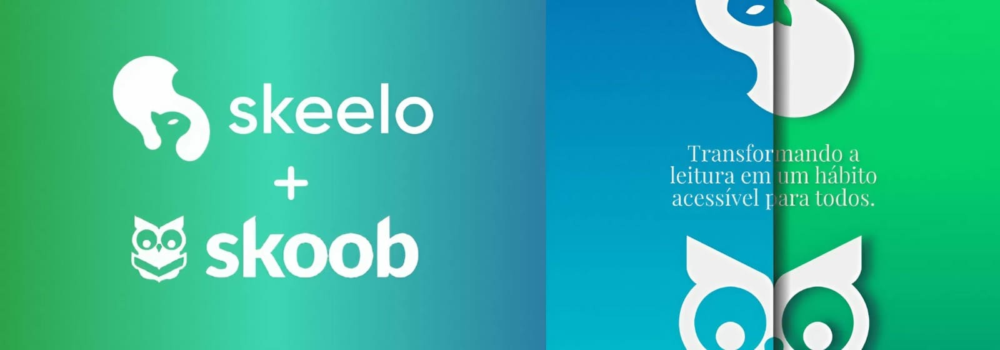

# Skeelo-Skoob Epics

## Project Description

An interactive landing page that showcases the epics of the **Skeelo–Skoob digital reading ecosystem**, designed to make project goals easier to understand and track through a dynamic and visual interface.

- Notion case: [Digital Reading Ecosystem | Notion](https://eliscmattosinho.notion.site/Ecossistema-de-leitura-digital-15432edc5fc5805a8ecfe3447f2d3d0b)

## Screenshots

- Project on Behance: [Skeelo-Skoob Epics | Behance](https://www.behance.net/gallery/231311471/Skeelo-Skoob-Epics-of-the-Digital-Reading-Ecosystem)

## Technologies Used

- React 19
- React Router DOM 7
- React Icons
- Vite
- Sass (SCSS)
- JavaScript (ES6+)
- GitHub Pages (deployment)

## Deployment

The project is configured to be deployed on **GitHub Pages** using the `gh-pages` package and Vite build output.

Live version available at:

- [Live Demo](https://eliscmattosinho.github.io/lp-skeelo-skoob-epics/)

 

